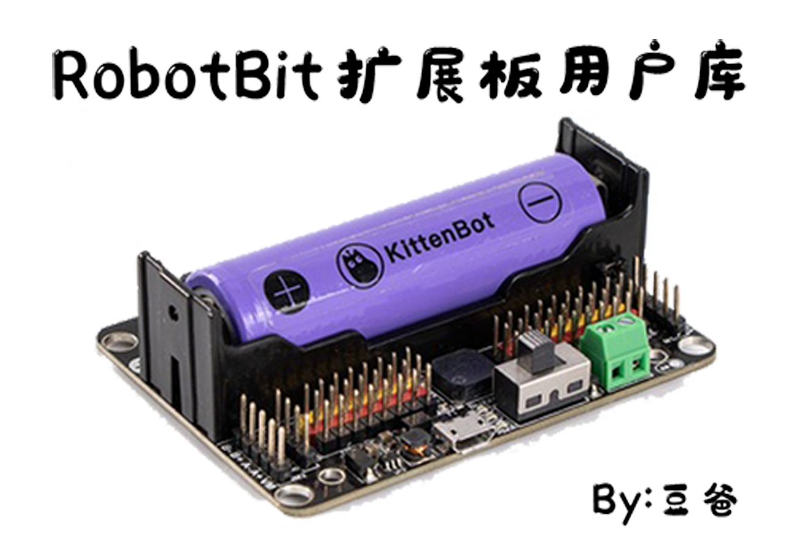

# Robotbit扩展板Mind+用户库

#### 介绍

Robotbit扩展板Mind+用户库实现了对Robotbit扩展板的图形化编程。

用户库加载地址：[https://gitee.com/hmilycheng/ext-robotbit](https://gitee.com/hmilycheng/ext-robotbit)

#### 积木

#### 示例程序

#### 许可证

  MIT

#### 支持列表

| 主板型号 | 实时模式 | ArduinoC | MicroPython | 备注 |
|------|------|----------|-------------|----|
| 掌控板  |      |          | √           |    |

#### 更新日志

  -  v0.0.1  2021-12-19首次发布